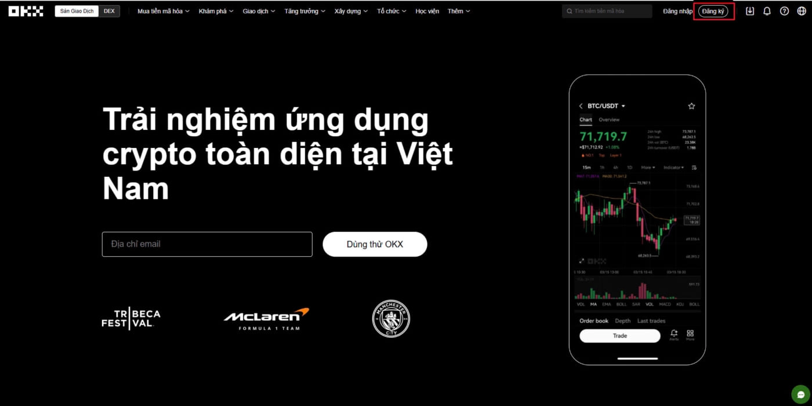
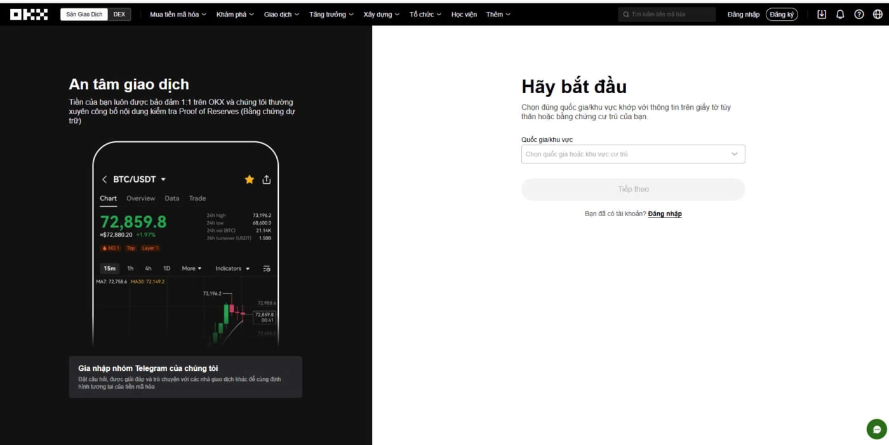

# 如何在OKX开户：最详细的注册教程

---

对于想要进入加密货币交易的新手来说，选择一个安全可靠、操作简单的平台至关重要。OKX作为全球领先的加密货币交易所之一，以其丰富的交易品种、有竞争力的费率和完善的安全机制受到用户青睐。本文将手把手教你如何在OKX开设账户，整个过程只需要几分钟，即使是第一次接触加密货币的朋友也能轻松上手。

---

## 为什么选择OKX？

在决定开户之前，先来看看OKX有哪些优势：

**产品线够全**。不管你是想做现货交易、合约交易，还是想通过质押赚收益，OKX都能满足你的需求。从基础的买卖加密货币，到更高级的杠杆交易、理财产品，一个平台就能搞定。

**费用真的低**。交易手续费最低可以达到0.08%，特别是持有OKB（OKX平台币）的用户还能享受更多优惠。对于经常交易的人来说，这个费率能省不少钱。

**界面友好，支持中文**。不用担心看不懂英文界面，OKX提供完整的中文支持，所有操作说明都很清楚。

**安全性高**。平台采用多重安全机制，包括双重身份验证（2FA）、冷钱包存储等，保护你的资产安全。

## 开户流程：一步步带你注册

### 第一步：访问OKX官网

打开浏览器，👉 [直接进入OKX注册页面](https://www.okx.com/join/62834398)。如果页面显示的是其他语言，可以在右上角选择切换到中文。

### 第二步：填写注册信息

点击页面右上角的"注册"按钮。你有两种注册方式可以选择：

**用邮箱注册**：适合大多数人，用你的常用邮箱就行。

**用手机号注册**：如果更习惯用手机号，也可以选这个。

填写注册信息时要注意：
- 邮箱或手机号必须是你本人的，后面会用来接收验证码
- 密码要设置得复杂一点，至少8位，包含大写字母、小写字母和数字
- 记得勾选"我同意服务条款"
- 填完后点击"下一步"

### 第三步：验证你的邮箱或手机

OKX会向你提供的邮箱或手机发送一个6位数的验证码。

- 如果是邮箱注册，去你的邮箱收件箱查看（记得看看垃圾邮件箱）
- 如果是手机注册，等待短信验证码
- 把验证码填入页面，点击确认

验证码通常几秒钟就会收到，如果一直没收到可以点击"重新发送"。

### 第四步：设置双重身份验证（2FA）

这一步很重要，虽然不是必须立即完成，但强烈建议你设置好。双重身份验证就像给你的账户加了一把额外的锁，即使别人知道你的密码，没有验证码也进不去。

推荐使用Google Authenticator（谷歌验证器）：
- 下载Google Authenticator应用（iOS和安卓都有）
- 扫描OKX显示的二维码
- 把应用生成的6位数验证码输入页面

记住要保存好恢复密钥（通常是一串字母和数字），如果手机丢了，可以用这个恢复访问权限。

### 第五步：完成身份验证（KYC）

身份验证是为了符合金融监管要求，也是保护你账户安全的重要步骤。👉 [立即完成KYC认证，开始交易](https://www.okx.com/join/62834398)

准备好这些材料：
- 身份证或护照
- 清晰的个人照片（用于人脸识别）

上传证件时注意：
- 照片要清晰，四个角都要拍到
- 确保证件上的信息清晰可见
- 自拍照片要确保光线充足，脸部清楚

审核通常在几分钟到几小时内完成，完成后你就能正常充值和交易了。

## 开户时需要注意什么？

**信息一定要准确**。你填写的姓名、证件号码必须和身份证件完全一致，否则会导致验证失败。如果证件上的名字和你常用的不一样，也要按证件上的填。

**保管好你的账户信息**。密码要记牢，2FA的恢复密钥要保存在安全的地方。最好不要用截图保存这些敏感信息，可以写在纸上锁起来。

**不要共享账户**。你的OKX账户只能你自己使用，不要把登录信息告诉别人，即使是很熟的朋友。平台也不会主动问你要密码。

**多层保护更安全**。除了Google Authenticator，还可以同时开启短信验证，双重保护让账户更安全。

## 常见问题解答

**开户需要付费吗？**

完全免费。注册OKX账户不需要任何费用，也没有账户维护费。只有当你实际交易时才会产生交易手续费。

**开户需要准备什么？**

- 一个有效的邮箱或手机号
- 有效的身份证件（身份证或护照）
- 一部带摄像头的手机（用于人脸识别）

**注册后能马上交易吗？**

注册完成后还不能立即交易。你需要先完成身份验证（KYC），然后充值到账户，才能开始交易。整个过程通常在一小时内就能完成。

**如果忘记密码怎么办？**

在登录页面点击"忘记密码"，按照提示通过邮箱或手机重置密码。这就是为什么注册信息一定要准确的原因。

**可以同时注册多个账户吗？**

不建议。按照OKX的规定，一个人只应该有一个账户。如果被发现有多个账户，可能会被限制使用。

## 注册完成后该做什么？

账户开好后，先别急着交易。可以先：

1. **熟悉平台功能**。看看各个板块在哪里，了解怎么充值、提现、交易。
2. **设置好所有安全选项**。除了2FA，还可以设置防钓鱼码、地址白名单等。
3. **小额尝试**。第一次充值不要太多，先小额试试整个流程，熟悉后再增加金额。
4. **学习基础知识**。OKX有学院板块，可以学习加密货币交易的基础知识。

---

## 总结

在OKX开户其实很简单，从注册到完成身份验证，整个过程最多半小时就能搞定。关键是要重视账户安全，把该设置的安全措施都设好。OKX作为全球领先的加密货币交易平台，提供了丰富的交易品种和完善的安全保障，非常适合新手入门。👉 [马上注册OKX账户，使用邀请码62834398](https://www.okx.com/join/62834398)，开启你的加密货币交易之旅。
